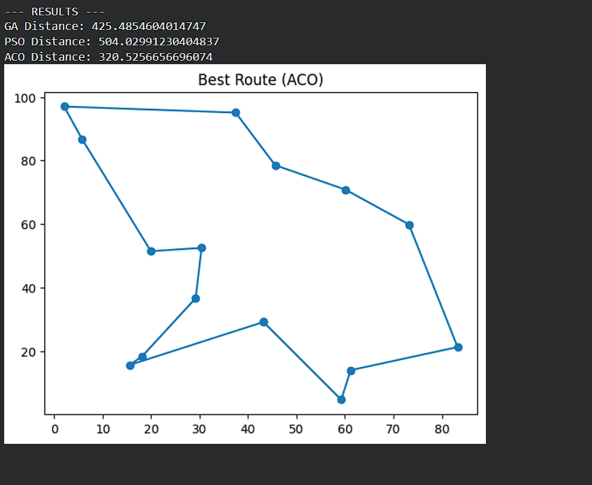

# Travelling Salesman Problem (TSP) using GA, PSO, and ACO

## Overview

This project implements and compares three metaheuristic algorithms — Genetic Algorithm (GA), Particle Swarm Optimization (PSO), and Ant Colony Optimization (ACO) — to solve the Travelling Salesman Problem (TSP).

The objective is to determine the shortest possible route that visits each city exactly once and returns to the starting point.

## Algorithms Implemented

* **Genetic Algorithm (GA)**
* **Particle Swarm Optimization (PSO)**
* **Ant Colony Optimization (ACO)**

## Project Structure

TSP-Optimization/
│── code/
│    └── ot_project.py
│── report/
│    └── Project_report.docx
│── output.png
│── README.md

## Requirements

Install the required Python libraries:

pip install numpy matplotlib

## How to Run

Execute the following command:
python code/ot_project.py

## Output

* Prints the best distance obtained using GA, PSO, and ACO
* Displays the optimal route graph

